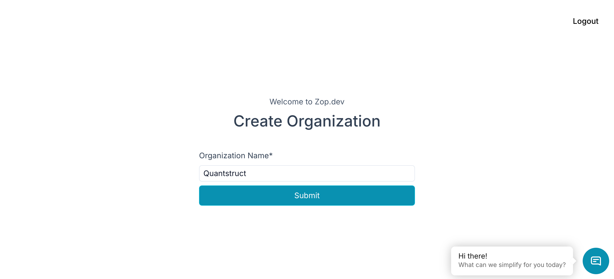
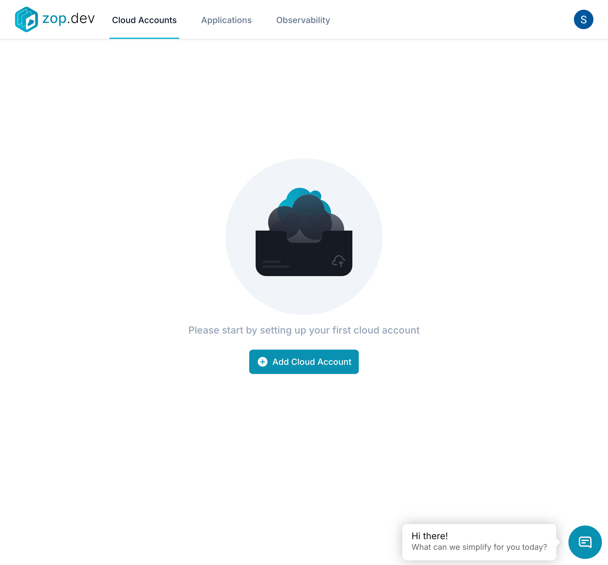
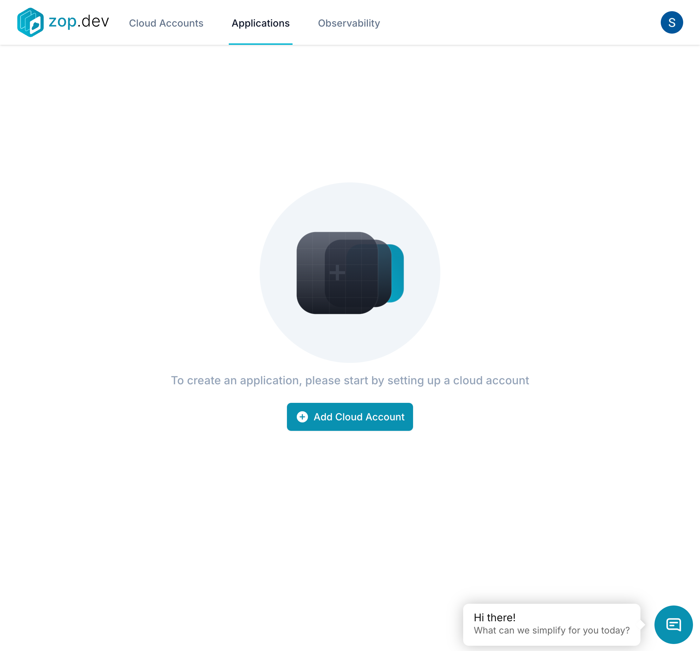
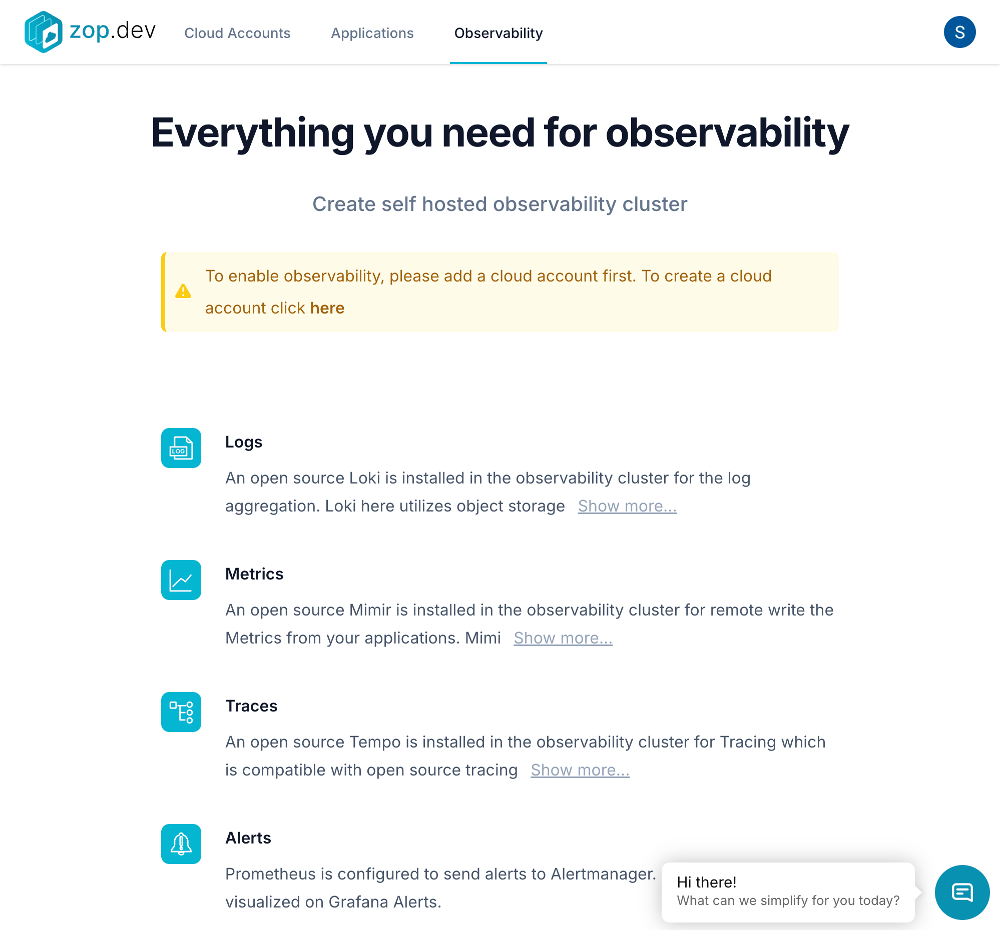

# Zop.dev Quickstart Guide

## Overview
Zop.dev is a platform for managing multi-cloud infrastructure, providing seamless integration across AWS, GCP, and Azure. This guide will walk you through the essential steps to get started.

## Prerequisites
- A zop.dev account
- Access to at least one cloud provider (AWS, GCP, or Azure)
- Required cloud provider credentials
- Review the [detailed prerequisites documentation](https://zop.dev/docs/application/add-application#prerequisites) for complete requirements

## Step 1: Create Your Organization

1. After signing in, you'll be prompted to create an organization
2. Enter your organization name
3. Click "Submit" to create your organization

## Step 2: Add Your First Cloud Account

1. Navigate to the Cloud Accounts section
2. Click "Add Cloud Account"
3. Choose your cloud provider:
   - **GCP**: Requires Service Account Key JSON
   - **AWS**: Requires Access Key ID and Secret Access Key
   - **Azure**: Requires Subscription ID, Tenant ID, Client ID, and Client Secret

For detailed setup instructions for each provider, see:
- [AWS Setup Guide](https://zop.dev/docs/cloud-account/configuration#1-aws-amazon-web-services)
- [GCP Setup Guide](https://zop.dev/docs/cloud-account/configuration#2-gcp-google-cloud-platform)
- [Azure Setup Guide](https://zop.dev/docs/cloud-account/configuration#3-azure-microsoft-azure)

### For GCP Setup:
1. Click "Connect with Google Cloud" or choose manual setup
2. Provide a name for your cloud account
3. Enter your Service Account Credential (JSON)
4. Click "Add" to complete the setup

## Step 3: Configure Applications

Once your cloud account is configured:
1. Navigate to the Applications tab
2. Click "Add Application"
3. Configure your application:
   - Set application name
   - Choose cloud account
   - Optional: Configure SQL or Redis instances

For detailed application configuration options, see:
- [Adding Applications Guide](https://zop.dev/docs/application/add-application#adding-applications)
- [Service Configuration Guide](https://zop.dev/docs/application/add-application#configuring-and-monitoring-services)
- [Cron Jobs Setup](https://zop.dev/docs/application/add-cron)

## Step 4: Enable Observability

Zop.dev provides comprehensive observability tools:
1. **Logs**: Using Loki for log aggregation
2. **Metrics**: Using Mimir for metrics collection
3. **Traces**: Using Tempo for distributed tracing
4. **Alerts**: Using Prometheus and Alertmanager

### Setting Up Observability:
1. Navigate to the Observability tab
2. Add a cloud account for observability if not already done
3. Choose to create a new cluster or use existing
4. Access Grafana using provided credentials

For detailed observability setup and usage:
- [Logs Configuration](https://zop.dev/docs/application/observability#logs)
- [Metrics Setup](https://zop.dev/docs/application/observability#metrics)
- [Traces Configuration](https://zop.dev/docs/application/observability#traces)
- [Alert Management](https://zop.dev/docs/application/observability#alerts)

## Best Practices
- Use meaningful names for cloud accounts and applications
- Configure alerts for critical services
- Regularly review [audit logs](https://zop.dev/docs/application/observability#audit-logs)
- Set up proper access controls through the [permissions system](https://zop.dev/docs/application/observability#permissions)

## Managing Cloud Resources
For detailed information about managing your cloud resources:
- [Infrastructure Management](https://zop.dev/docs/cloud-account/configuration#managing-cloud-accounts)
- [Resource Access Guide](https://zop.dev/docs/cloud-account/configuration#accessing-resources)
- [Observability Cluster Setup](https://zop.dev/docs/cloud-account/configuration#observability-cluster)

## Additional Resources
- Documentation: [https://zop.dev/docs](https://zop.dev/docs)
- Support: info@zop.dev
- Schedule a call: Available through zop.dev website
- [8-Minute Product Walkthrough Video](https://zop.dev/docs#8-minute-product-walkthrough)